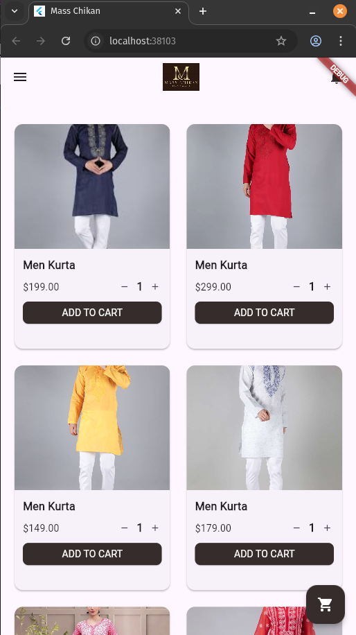

# Shopping Cart Application

Exercise Challenge for Mobile Programming

## Pre requisites

- Flutter SDK
- Android Studio
- Java SDK
- Emulator
- IDE (Intellij/VScode)

## Module Stucture
---

### `lib/modules/cart`

* **models/** – Contains data models related to the shopping cart feature.
* **cart\_items.dart** – Defines the structure for individual items in the shopping cart.
* **shopping\_cart.dart** – Manages the entire shopping cart, including item operations and totals.

---

### `lib/modules/home`

* **config/** – Stores configuration settings specific to the home module.
* **config.dart** – Contains constants or settings used across the home screen.
* **models/** – Holds data models relevant to home features like products.
* **product.dart** – Defines the data model for a product displayed in the app.
* **home_content.dart** – Builds the main content layout of the home screen.
* **home_drawer.dart** – Implements the navigation drawer for the home section.
* **home_screen.dart** – Represents the overall home screen widget tying content and drawer together.

---

### Steps to Run this Project
- Before running this project make sure you have flutter installed and have all the requirements for the same
  - Run the following command to check system readiness to run this project ``` flutter doctor ```
- Open the project in VSCode/intellij
- Run the project from terminal via the following command 
``` flutter clean 
    flutter pub get
    flutter run
    // select the device for running the project
```

### Screenshots for the UI
| Screen                 | Chrome Preview                                           | Android Preview                                           |
|------------------------|----------------------------------------------------------|------------------------------------------------------------|
| Home Screen            |    |    |
| Shopping Cart View     |  |  |
| Navigation Drawer View |        |        |

